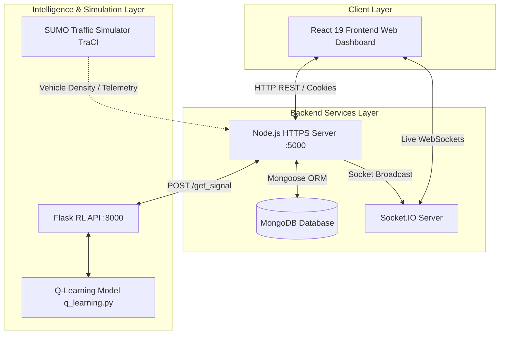
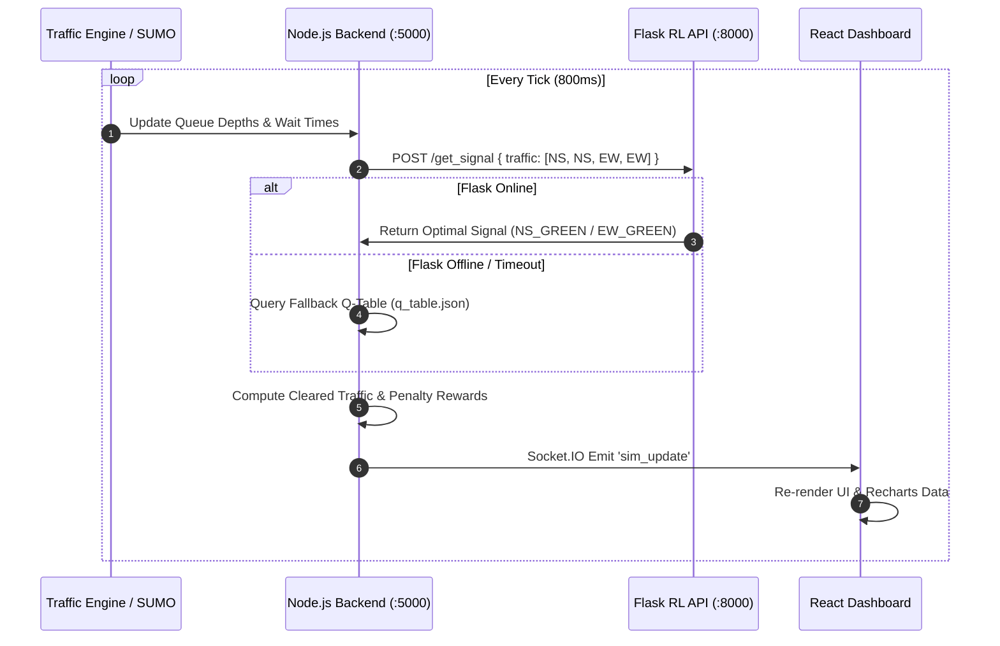

# RL-Based Smart Traffic Signal Control

[](https://opensource.org/licenses/ISC)
[](https://react.dev/)
[](https://nodejs.org/)
[](https://expressjs.com/)
[](https://www.python.org/)
[](https://flask.palletsprojects.com/)
[](https://eclipse.dev/sumo/)
[](https://www.mongodb.com/)
[](https://www.docker.com/)
[](https://www.jenkins.io/)

An intelligent, real-time dynamic traffic signal management system powered by **Reinforcement Learning (Q-Learning)** and microscopic traffic simulation (**SUMO**). Designed to minimize vehicle wait times, eliminate unnecessary signal delays, and maximize intersection throughput via an adaptive state-action feedback loop.

---

## Problem Statement & Project Goal

### The Problem
Traditional traffic light systems operate on **fixed timers** or rudimentary loop detectors. They cannot adapt to dynamic, real-time traffic fluctuations, leading to:
- Excessive idling times at red lights during off-peak hours.
- Severe congestion bottlenecks during peak rush hours.
- Higher fuel consumption and vehicle emissions.

### The Solution
Our solution replaces static fixed timers with a **Q-Learning Reinforcement Learning agent**. The agent receives continuous state inputs (vehicle counts, queue lengths, and waiting durations across lanes), evaluates the optimal signal configuration (`North-South Green` vs `East-West Green`), and switches signals dynamically to maximize vehicle clearance while penalizing queue build-ups and switching delays.

---

## Key Features

- **Adaptive Reinforcement Learning Agent**: Dynamically adjusts signal light states based on queue density and waiting time penalties using Q-Table optimization.
- **Microscopic Traffic Simulation (SUMO & TraCI)**: Real-time physical traffic network modeling using Eclipse SUMO with TraCI (Traffic Control Interface) Python bindings.
- **Real-Time Collaborative Web Dashboard**: Live Socket.IO bi-directional streaming of intersection states, queue lengths, active lights, and metrics visualization with Recharts.
- **Hybrid High-Availability Architecture**: Dual-tier decision engine using a Python Flask ML microservice (`:8000`) with an embedded Node.js backend fallback Q-Table (`q_table.json`).
- **Enterprise-Grade Authentication**: Full user lifecycle management with JWT HTTP-only cookies, password hashing (Bcrypt.js), OTP email verification (Nodemailer), and HTTPS encryption.
- **Containerization & CI/CD Pipeline**: Docker Compose orchestration for multi-container deployment and automated Jenkins deployment workflow (`Jenkinsfile`).

---

## Tech Stack & Technologies Used

### **Frontend** (`client/`)
| Technology | Role / Usage |
| :--- | :--- |
| **React 19** | User interface framework & dynamic component rendering |
| **Vite 7** | Next-generation frontend build tool and hot module replacement |
| **Tailwind CSS 3.4** | Utility-first CSS styling for modern UI/UX design |
| **Recharts** | Interactive charts for real-time traffic analytics and metrics |
| **Socket.IO Client** | WebSocket client for receiving live simulation frames from the server |
| **React Router DOM v7**| Client-side routing and protected routes navigation |
| **Axios** | HTTP client for REST API interaction |
| **React Toastify** | Elegant floating user notifications |

### **Backend** (`server/`)
| Technology | Role / Usage |
| :--- | :--- |
| **Node.js** | Server-side JavaScript runtime environment |
| **Express.js** | RESTful API server & middleware handler |
| **MongoDB & Mongoose** | Document database for user accounts, session state, and system configs |
| **Socket.IO** | WebSocket server broadcasting live traffic updates every 800ms |
| **JSON Web Tokens (JWT)** | Secure authentication and authorization state management |
| **Nodemailer** | Transports OTP emails for account verification & password reset |
| **HTTPS (TLS/SSL)** | Secure local development using self-signed certificates (`certs/`) |

### **Machine Learning & Simulation** (`rl_model/`)
| Technology | Role / Usage |
| :--- | :--- |
| **Python 3.10+** | Core programming language for RL algorithms and simulation control |
| **Flask API** | REST service exposing `/get_signal` endpoint on port `8000` |
| **Q-Learning Agent** | Tabular Q-Learning (`q_learning.py`) with state discretization and reward calculation |
| **Eclipse SUMO** | Simulation of Urban MObility suite for realistic multi-lane vehicle physics |
| **TraCI (Python)** | Traffic Control Interface for live state retrieval and signal overrides |

### **DevOps & Infrastructure**
| Technology | Role / Usage |
| :--- | :--- |
| **Docker & Docker Compose** | Multi-container orchestration (`mongo`, `backend`, `frontend`) |
| **Jenkins** | Continuous Integration and Deployment pipeline execution (`Jenkinsfile`) |

---

## System Architecture & Workflow

### 1. Overall System Architecture



### 2. Traffic Signal Decision Loop



---

## Repository Structure

```
Capstone_project/
│
├── README.md                      # Primary project documentation
├── docker-compose.yml             # Docker multi-container orchestration configuration
├── Jenkinsfile                    # Automated CI/CD deployment pipeline script
├── requirements.txt               # Python dependencies for RL model & simulation
├── CONTRIBUTING.md                # Developer contribution guidelines
├── rl_model_analysis.md           # Deep dive technical breakdown of Q-Learning logic
│
├── certs/                         # SSL/TLS certificate directory for HTTPS server
│   ├── localhost.pem              # Local SSL Certificate
│   └── localhost-key.pem          # Local SSL Private Key
│
├── client/                        # React 19 Frontend Web Application
│   ├── public/                    # Static public assets (bg_img.png, favicon.svg)
│   ├── src/
│   │   ├── api/                   # API service helpers & Axios instances
│   │   ├── assets/                # Visual design images, icons, and graphics
│   │   ├── components/            # Reusable UI components (Navbar, Simulation, Header)
│   │   ├── pages/                 # Application views (Dashboard, TrafficSimulation, Login, Register)
│   │   ├── App.jsx                # Main route configuration & providers
│   │   └── q_table.json           # Client-side Q-table visualization data
│   ├── package.json               # Frontend dependencies & scripts
│   ├── vite.config.js             # Vite build & dev server setup
│   └── tailwind.config.js         # Tailwind CSS design system rules
│
├── server/                        # Node.js / Express Backend Engine
│   ├── config/                    # Database (mongodb.js) & backend Q-table fallback
│   ├── controllers/               # Auth & traffic request controller logic
│   ├── middleware/                # User authentication middleware (userAuth.js)
│   ├── models/                    # Mongoose database schemas (User.js)
│   ├── routes/                    # Express API route endpoints (authRoutes, trafficRoutes)
│   ├── services/                  # Traffic simulation engine singleton (trafficSim.js)
│   ├── server.js                  # Main Express HTTPS & Socket.IO server entry point
│   └── package.json               # Backend dependencies & scripts
│
└── rl_model/                      # Reinforcement Learning & SUMO Engine
    ├── app.py                     # Flask API serving signal decisions (:8000)
    ├── q_learning.py              # Q-Learning algorithm implementation & TrafficRL class
    └── sumo_sim/                  # Microscopic traffic network simulation files
        ├── run_sumo.py            # SUMO TraCI interface script
        ├── cross.net.xml          # Network topology file
        ├── cross.rou.xml          # Vehicle route demand file
        └── cross.sumocfg          # Main SUMO configuration file
```

---

## Preserved Image & Media Assets Catalog

All design assets and UI images are located within [`client/src/assets/`](file:///e:/Capstone_project/Capstone_project/client/src/assets) and [`client/public/`](file:///e:/Capstone_project/Capstone_project/client/public):

| Image File | Location | Purpose & Usage in Dashboard |
| :--- | :--- | :--- |
| `header_img.png` | `client/src/assets/header_img.png` | Main landing page hero header visualization |
| `bg_img.png` | `client/src/assets/bg_img.png` & `client/public/bg_img.png` | Authentication & app background gradient backdrop |
| `hand_wave.png` | `client/src/assets/hand_wave.png` | Welcome banner greeting icon |
| `logo.svg` | `client/src/assets/logo.svg` | Main application brand logo |
| `arrow_icon.svg` | `client/src/assets/arrow_icon.svg` | UI navigation and action button directional indicator |
| `lock_icon.svg` | `client/src/assets/lock_icon.svg` | Password input field icon |
| `mail_icon.svg` | `client/src/assets/mail_icon.svg` | Email address input field icon |
| `person_icon.svg` | `client/src/assets/person_icon.svg` | Profile and username input field icon |
| `favicon.svg` | `client/src/assets/favicon.svg` & `client/public/favicon.svg` | Web browser favicon icon |
| `react.svg` | `client/src/assets/react.svg` | React framework logo |

---

## API & Event Specification

### 1. Authentication REST Endpoints (`/api/auth`)
- `POST /api/auth/register`: Register new user account.
- `POST /api/auth/login`: Authenticate user credentials & issue JWT HTTP-only cookie.
- `POST /api/auth/logout`: Revoke session cookie.
- `POST /api/auth/send-verify-otp`: Generate & send email OTP via Nodemailer.
- `POST /api/auth/verify-account`: Confirm email verification code.
- `POST /api/auth/send-reset-otp`: Request password reset OTP.
- `POST /api/auth/reset-password`: Update account password using reset token.
- `GET /api/auth/check`: Check session validity (Protected route).

### 2. Reinforcement Learning Microservice (`http://localhost:8000`)
- `POST /predict`: Accepts `{ ns_queue, ew_queue, light, time_in_phase }` and returns a DQN action (`0` keep / `1` switch) plus the resulting signal.
- `GET /health`: Reports whether the saved DQN model has loaded.

### 3. Socket.IO Real-Time Protocol (`ws://localhost:5000`)
- **Server Output (`sim_update`)**:
  ```json
  {
    "nsQueue": 4,
    "ewQueue": 2,
    "light": 0,
    "cleared": 42,
    "reward": 18.5,
    "cumulativeReward": 340.0,
    "isRunning": true,
    "spawnRate": 0.4,
    "lanes": 4,
    "simMode": "intersection"
  }
  ```
- **Client Commands**:
  - `start_sim`: Begin traffic simulation timer.
  - `pause_sim`: Pause simulation ticks.
  - `reset_sim`: Reset queues, rewards, and light counters.
  - `set_spawn_rate`: Dynamically alter vehicle arrival frequency (0.1 - 1.0).
  - `update_config`: Modify intersection layout (lanes, modes).

---

## Installation & Setup Guide

### Prerequisites
- [Node.js](https://nodejs.org/) (v18 or higher) & `npm`
- [Python](https://www.python.org/) (v3.10 or higher) & `pip`
- [MongoDB](https://www.mongodb.com/) (Local instance or MongoDB Atlas connection URI)
- Optional: [Eclipse SUMO](https://eclipse.dev/sumo/) (for physical micro-simulation GUI execution)
- Optional: [Docker Desktop](https://www.docker.com/)

---

### Option A: Local Development Setup (Manual)

#### 1. Backend Setup (`server/`)
```bash
cd server
npm install
```
Create a `.env` file inside `server/`:
```env
PORT=5000
MONGO_URI=mongodb://localhost:27017/Capstone
JWT_SECRET=your_jwt_secret_key
SMTP_USER=your_email@gmail.com
SMTP_PASS=your_app_password
BASE_URL=https://localhost:5000
```
Start the backend server:
```bash
npm run dev
```

#### 2. Reinforcement Learning Model Server (`rl_model/`)
```bash
cd rl_model
pip install -r ../requirements.txt
python app.py
```
*(Runs Flask API on http://localhost:8000)*

#### 3. SUMO Simulation (Optional GUI micro-sim)
```bash
cd rl_model/sumo_sim
python run_sumo.py
```

#### 4. Frontend Setup (`client/`)
```bash
cd client
npm install
npm run dev
```
*(Access dashboard at https://localhost:5173)*

---

### Option B: Containerized Docker Setup

Run the full stack (MongoDB + Express Backend + React Frontend) using Docker Compose:

```bash
docker-compose up --build -d
```

To stop containers:
```bash
docker-compose down -v
```

---

## CI/CD Pipeline (Jenkins)

The project includes an automated deployment pipeline defined in [`Jenkinsfile`](file:///e:/Capstone_project/Capstone_project/Jenkinsfile). The pipeline performs the following stages:
1. **Checkout**: Pulls the latest commits from the repository branch.
2. **Stop Old Containers**: Safely shuts down any existing running Docker containers (`docker compose down -v --remove-orphans`).
3. **Build Docker Images**: Compiles updated images without cache (`docker compose build --no-cache`).
4. **Deploy Containers**: Launches multi-container instances in detached mode (`docker compose up -d`).
5. **Verify Deployment**: Logs running container states and docker images (`docker ps`, `docker images`).

---

## Team Members & Credits

- **Shivanshi**
- **Tanvi**
- **Himadri**

---

## License

This project is open-source software licensed under the [ISC License](LICENSE).
